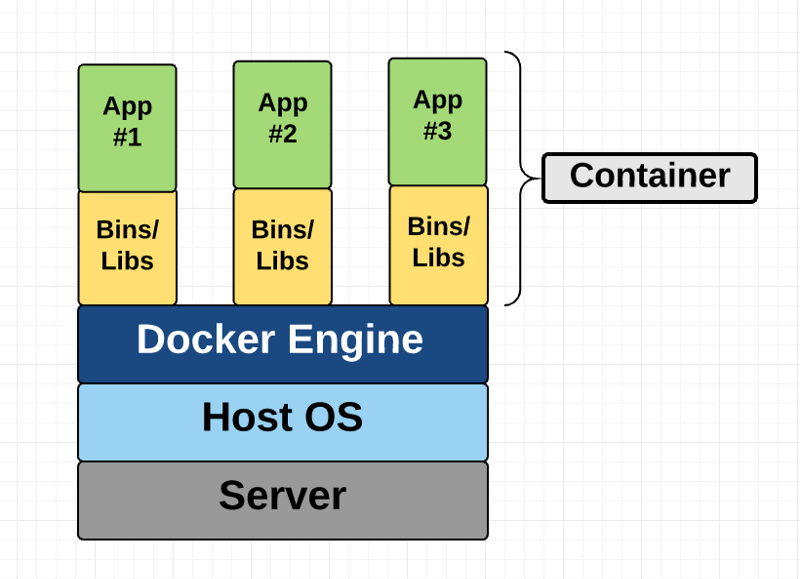
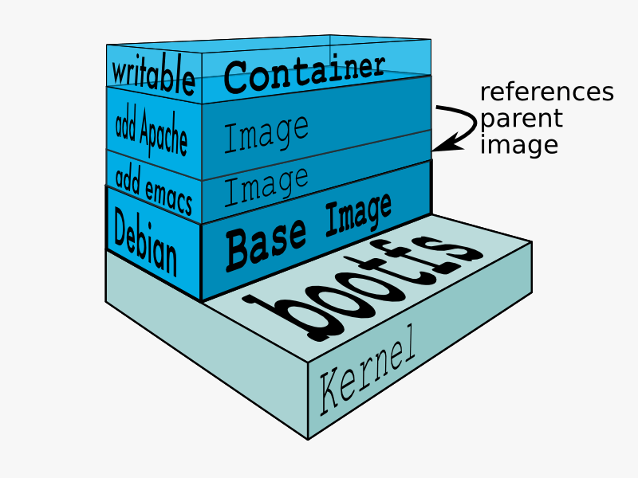

# Docker in 20 minutes

Content
* Intro - what & why is Docker
* Key abstractions in Docker 
* Key Docker (CLI) commands
* Workshop
* Volumes
* Network
* Docker compose
* Docker Daemon config
* Register
* Docker Java features

## 1. Intro - what & why is Docker

- Docker is a software (bunch of modules Docker Engine, Docker CLI & etc.) to manage containers
- Container is a standard unit of software that packages up code and all its dependencies
- application in containers runs quickly and reliably from one computing environment to another (env agnostic)
- unit(layer) of software that allows developers to isolate their app from its environment
- solving the "it works on my machine" headache
- dev + deploy + run -> app
- virtualization vs containerization = containers fast & lightweight







(images mainly from original Docker documentation)

- OS specific features for Docker Daemon
- Linux has more physiological Docker implementation

## 2. Key abstractions in Docker 
- Dockerfile
- Image
- Container
- Docker Daemon
- Registry

## 3. Key Docker (CLI) commands

Display system-wide information
```bash
docker info	
```
example:
```bash
Client:
 Debug Mode: false

Server:
 Containers: 27
  Running: 1
  Paused: 0
  Stopped: 26
 Images: 58
 Server Version: 19.03.8
 Storage Driver: overlay2
```

Build an image from a Dockerfile
```bash
docker build	
```

example
```bash
docker build . -t supername:supertag
```

Create a new image from a container’s changes
```bash
docker commit	
```

```bash
docker commit [CONTAINER_ID] name:tag
```

Copy files/folders between a container and the local filesystem
```bash
docker cp	
```

Run a command in a running container
```bash
docker exec	-ti [CONTAINER_ID] /bin/bash
```

Fetch the logs of a container
```bash
docker logs [CONTAINER_ID]
```

List containers
```bash
docker ps	
```

example:
view all existed containers, even not running
```bash
>docker ps -a
CONTAINER ID        IMAGE                                             COMMAND                  CREATED             STATUS                     PORTS                                                                    NAMES
c47deeb8cde9        hello-world                                       "/hello"                 2 days ago          Exited (0) 2 days ago                                                                               loving_kepler```
```

List images
```bash
docker images	
```

example:
```bash
>docker images
REPOSITORY                                  TAG                 IMAGE ID            CREATED             SIZE
hello-world                                 latest              bf756fb1ae65        7 months ago        13.3kB
```


Get Detailed info Image/Container
```bash
docker inspect [IMAGE_ID/CONTAINER_ID]
```

Get container Ip in host
```bash
docker inspect -format '{{range .NetworkSettings.Networks}}{{.IPAddress}}{{end}}' container_name_or_id
```

Dive into container
```bash
docker exet -ti --name=root [CONTAINER_ID] /bin/bash
```


Remove one or more containers
```bash
docker rm -f [CONTAINER_ID_1] [CONTAINER_ID_2]
```

Remove one or more images
```bash
docker rmi -f [IMAGE_ID_1] [IMAGE_ID_2]
```


## 4. Workshop

### Step.01 Run first Docker container hello-world / lifecycle
### Step.02 Build a custom image from Dockerfile


## 5. Volumes
- inside container
- mount host directory to container

```bash
docker volume ls
DRIVER              VOLUME NAME
local               c5a62b9930e519a8465eab5fe155d1153dc2b5dba0e75b8d989944351ee60fab
local               e6a0e29d36b9aa7ca4002852ba2ae874168a1cd09ede767de32a522855d9eed3

docker inspect c5a62b9930e519a8465eab5fe155d1153dc2b5dba0e75b8d989944351ee60fab
[
    {
        "CreatedAt": "2020-08-11T09:07:29+03:00",
        "Driver": "local",
        "Labels": null,
        "Mountpoint": "/var/lib/docker/volumes/c5a62b9930e519a8465eab5fe155d1153dc2b5dba0e75b8d989944351ee60fab/_data",
        "Name": "c5a62b9930e519a8465eab5fe155d1153dc2b5dba0e75b8d989944351ee60fab",
        "Options": null,
        "Scope": "local"
    }
]
```


## 6. Network

```bash
docker network ls
NETWORK ID          NAME                DRIVER              SCOPE
7b83aace1508        bridge              bridge              local
480340d52ba5        farm_default        bridge              local
cbe610b326b7        host                host                local
f47a8683604c        none                null                local
```


## 7. Docker compose

docker-compose.yml
```yml
version: "3.4"

services:

  cti_iot_clickhouse:
    build:
      context: clickhouse/
      dockerfile: ./Dockerfile
    image: cti/iot-clickhouse:3.0.0-SNAPSHOT
    container_name: cti_iot_clickhouse
    restart: always
    hostname: cti_iot_clickhouse
    ports:
      - 8123:8123
      - 9000:9000
    networks:
      - iot_network

  cti_iot_postgres:
    image: postgres:10.4
    container_name: cti_iot_postgres
    hostname: cti_iot_postgres
    restart: always
    environment:
      POSTGRES_PASSWORD: postgres
      POSTGRES_USER: postgres
      POSTGRES_DB: iot_domain
    ports:
      - 15432:5432
    tty: true
    networks:
      - iot_network

  cti_iot_consul:
    image: consul:1.1.0
    container_name: cti_iot_consul
    hostname: cti_iot_consul
    restart: always
    environment:
      CONSUL_LOCAL_CONFIG: '{"datacenter":"iot_dock", "server":true, "enable_debug":true}'
    command: agent -ui -data-dir /consul/data -server -bootstrap-expect 1 -client 0.0.0.0 -log-level debug
    ports:
      - "8300:8302/tcp"
      - "8500:8500/tcp"
      - "8301-8302:8301-8302/udp"
      - "8600:8600/tcp"
      - "8600:8600/udp"
    tty: true
    networks:
      - iot_network

  cti_iot_argon:
    image: cti/iot-argon:3.0.0-SNAPSHOT
    container_name: cti_iot_argon
    hostname: cti_iot_argon
    restart: always
    depends_on:
      - "cti_iot_consul"
      - "cti_iot_clickhouse"
    ports:
      - 11099:1099
      - 15005:5005
      - 18101:8101
      - 44441:44444
    tty: true
    networks:
      - iot_network
    links:
      - "cti_iot_consul:cti.iot.consul"
      - "cti_iot_clickhouse:cti.iot.clickhouse"

  cti_iot_front:
    build:
      context: front/
      dockerfile: ./Dockerfile
    image: cti/iot-front:3.0.0-SNAPSHOT
    container_name: cti_iot_front
    restart: always
    hostname: cti_iot_front
    depends_on:
      - "cti_iot_gateway"
    ports:
      - 18181:80
    networks:
      - iot_network

  cti_iot_gateway:
    image: cti/iot-gateway:3.0.0-SNAPSHOT
    container_name: cti_iot_gateway
    hostname: cti_iot_gateway
    restart: always
    depends_on:
      - "cti_iot_consul"
      - "cti_iot_application_rest"
    environment:
      - "SPRING_PROFILES_ACTIVE=docker"
    ports:
      - 18080:18080
      - 19999:9999
    tty: true
    networks:
      - iot_network

  cti_iot_application_rest:
    image: cti/iot-application-rest:3.0.0-SNAPSHOT
    container_name: cti_iot_application_rest
    hostname: cti_iot_application_rest
    restart: always
    depends_on:
      - "cti_iot_postgres"
    environment:
      - "SPRING_PROFILES_ACTIVE=docker"
    ports:
      - 18090:18090
    tty: true
    networks:
      - iot_network

networks:
  iot_network:
    driver: bridge
    ipam:
      driver: default
      config:
        - subnet: "10.155.0.1/16"

```


## 8. Docker Daemon config
- docker.json

How to change docker installation directory
```json
{
 ...
 "data-root": "/path/to/docker-data",
 ...
}
```

## 9. Register
Run a local registry
start the registry container:

```bash
docker run -d -p 5000:5000 --restart=always --name registry registry:2
```

## 10. Docker Java features

Dockerfile example
```bash
# Start with a base image containing Oracle Java runtime
FROM nimmis/java-centos:oracle-8-jdk

# BUILD_VERSION - defines at Gradle build
ARG BUILD_VERSION

# Also use ENV variable SPRING_PROFILES_ACTIVE=docker

# Add a volume pointing to /tmp
VOLUME /tmp

# Make port 8090 available to the world outside this container
EXPOSE 8090

# Add the application's fat jar to the container
COPY gateway-${BUILD_VERSION}.jar /opt/cti/iot/gateway.jar

# Run the jar file
ENTRYPOINT ["java","-Djava.security.egd=file:/dev/./urandom", "-Dspring.profiles.active=docker", "-Dgrails.env=docker", "-jar", "/opt/cti/iot/gateway.jar"]

```

